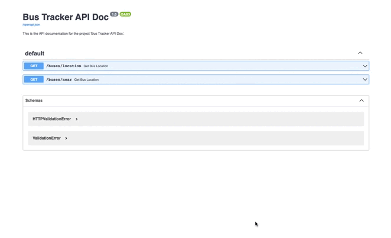
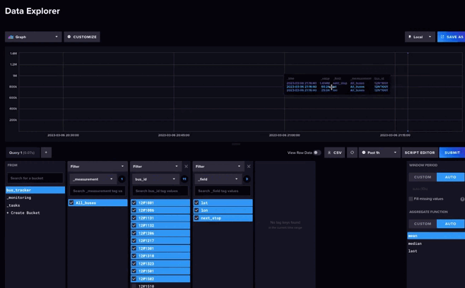

# Bus_Tracker  
  
### 1. About  
The purpose of this project is to create a program that transmits data via API about the location of all buses in Finland and the location of all buses nearby, as well as their next stops.   

The program uses the real-time data from https://digitransit.fi/en/developers/apis/4-realtime-api/vehicle-positions/ to provide information about the location of buses in Finland.  
  
### 2. Implementation  
The program uses a robust and reliable system to collect, process, and deliver real-time data about the location of all buses in Finland and buses nearby, as well as their next stops. Here's how the program works:    
  
1. The program receives data from the MQTT server, which is a messaging protocol that is widely used in IoT applications to transmit data between devices.  
2. The program then transmits the data to Kafka, which is a distributed streaming platform that provides high-throughput, low-latency messaging services.  
3. Kafka transfers the data to InfluxDB, which is a high-performance time-series database that can handle large volumes of data and has fast write and query capabilities.  
4. Finally, the data is made available to the user via Fast API over the HTTP protocol, which is a modern, fast, and lightweight web framework that allows for easy and efficient communication between the server and the client.  
  
Illustration of the work of the services:  
    


  
### 3. Launch  
  
Run the program using the command:  

  
```python
# Clone the repository:
git clone https://github.com/username/project.git

# Navigate to the project directory:
cd Bus_Tracker/

# Create images:
docker build -t api:latest -f api/Dockerfile .
docker build -t mqtt-kafka:latest -f mqtt-kafka/Dockerfile .
docker build -t kafka-influxdb:latest -f kafka-influxdb/Dockerfile .

# Run the docker-compose command to start the application:
docker-compose up
```
  
### 4. Contributing  
  
Contributions to this project are welcome. If you notice a bug or have a feature request, please open an issue on the repository. If you would like to contribute code, please fork the repository and submit a pull request with your changes.  
